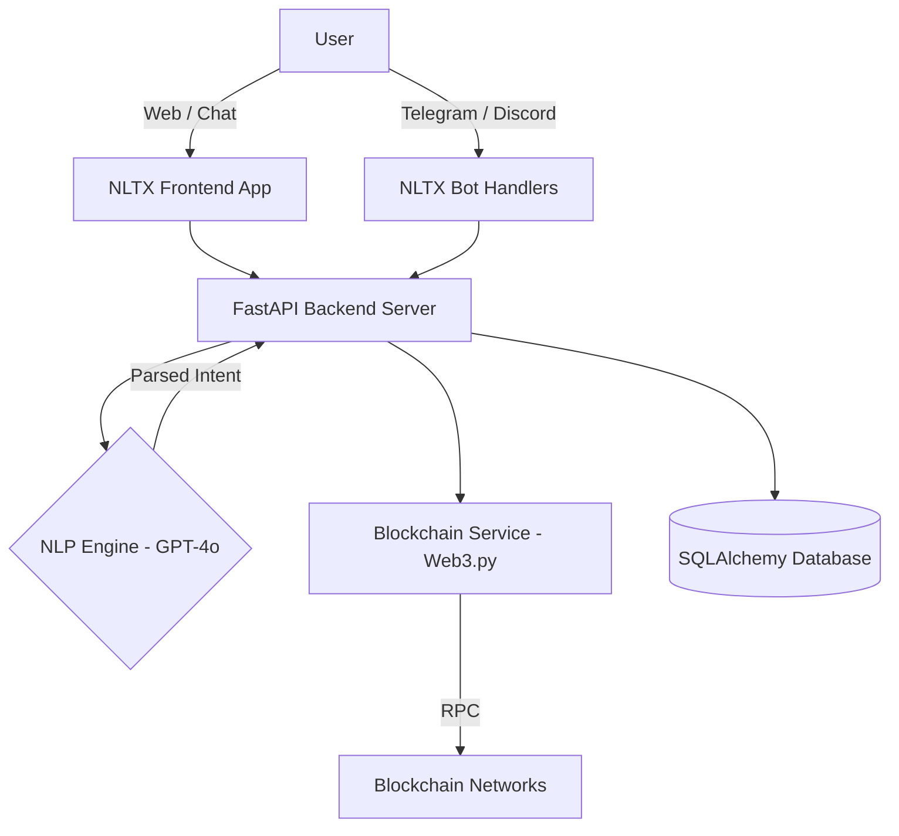

# NLTX — Natural Language Transaction Exchange ⬡

<div align="center">
  <h3>✨ The Next-Generation Generative Payment Platform ✨</h3>
  <p>Seamlessly manage and execute multi-chain crypto transactions using nothing but Natural Language.</p>
  
  [](https://www.python.org)
  [](https://fastapi.tiangolo.com)
  [](https://developer.mozilla.org/en-US/docs/Web/JavaScript)
  [](https://web3py.readthedocs.io/)
</div>

---

## 🚀 Vision

Web3 doesn't have to be complicated. **NLTX** aims to abstract away the overwhelming complexity of blockchain technology—networks, gas fees, contract addresses, and complex wallets—and replace it with a simple, intent-based conversational interface. 

With NLTX, sending crypto is as easy as sending a text message:
> *"Send 50 USDC to Priya on the Polygon network."*

Our system leverages powerful Generative AI (GPT-4o) alongside enterprise-grade security to interpret, validate, and execute your transaction safely and autonomously.

---

## 🌟 Core Features

### 🧠 Intent-Based NLP Engine
- Deep intent parsing using state-of-the-art LLMs.
- Understands complex queries like token swaps, network bridges, and balance checks.
- Zero learning curve for non-technical users.

### ⛓️ Multi-Chain Support
- Native support for Sepolia, Amoy, and other major testnets (Mainnet ready).
- Real-time balance aggregation across all connected wallets and networks.

### 🔒 Bank-Grade Security & MPC Architecture
- **30-Second Undo Window:** Every transaction enters a mempool-like safety net allowing users to cancel before it gets mined.
- **Dynamic 2FA Challenge:** High-value transactions (e.g., > $500) automatically trigger two-factor authentication.
- **Smart Fraud Detection:** Heuristic-based flagging for unusual transfer patterns.
- **Custom Spending Limits:** Set daily, weekly, or monthly caps to prevent wallet drainage.

### 🤖 Omnichannel Bot Integrations
Interact with your wallet wherever you are:
- **Telegram:** Deep-linked secure bot integration.
- **Discord:** Server-based slash commands and direct messaging.
- **WhatsApp:** Enterprise API webhook support.

---

## 🛠️ Project Architecture



### 📁 Repository Structure

```
nltx/
├── nltx-backend/          # Python/FastAPI Backend Engine
│   ├── app/
│   │   ├── api/           # RESTful API Endpoints
│   │   ├── bots/          # Omnichannel Bot Integrations
│   │   ├── models/        # Database Schema
│   │   ├── services/      # Core Business Logic (NLP, Web3, Auth)
│   │   └── main.py        # Application Entrypoint
│   └── run.py             # Server runner
└── nltx-app/              # Vanilla JavaScript & CSS Frontend
    ├── src/               # JS Logic & Styles
    ├── index.html         # Main Landing
    ├── chat.html          # NLP Chat Interface
    ├── dashboard.html     # Analytics Dashboard
    └── ...
```

---

## 🏗️ Setup & Installation

### 1. Backend (FastAPI Engine)

**Prerequisites:** Python 3.10+, pip, venv.

```bash
# Clone the repository
git clone https://github.com/SameerPendam/NLTX.git
cd nltx/nltx-backend

# Install dependencies
pip install -r requirements.txt

# Configure Environment Variables
cp .env.example .env
# Edit .env to add your OpenAI API Key, RPC URLs, and DB credentials.

# Run the server
python run.py
```
> **Tip:** The Telegram bot starts automatically if `TELEGRAM_BOT_TOKEN` is set. Use `python run.py --no-telegram` to run in API-only mode.

### 2. Frontend (Web Application)

**Prerequisites:** Any modern web browser.

```bash
cd ../nltx-app
# Serve using any static file server, for example:
npx serve -p 8080
# Or using Python:
python -m http.server 8080
```
> Navigate to `http://localhost:8080` in your browser.

---

## 📡 API Reference

Our robust REST API empowers third-party integrations and custom clients:

| Method | Endpoint | Description |
|--------|----------|-------------|
| `POST` | `/api/nlp/execute` | Parses and executes a natural language transaction intent. |
| `GET`  | `/api/wallet/balances` | Retrieves multi-chain portfolio aggregation. |
| `POST` | `/api/transactions/send`| Secure transaction submission with 2FA checks. |
| `POST` | `/api/users/platform/link` | Generates a secure code to pair omni-channel bots. |

---

## 🤝 Contributing

We welcome contributions from the community! To contribute:
1. Fork the repository.
2. Create your feature branch (`git checkout -b feature/AmazingFeature`).
3. Commit your changes (`git commit -m 'Add some AmazingFeature'`).
4. Push to the branch (`git push origin feature/AmazingFeature`).
5. Open a Pull Request.

---

## 📄 License

Distributed under the MIT License. See `LICENSE` for more information.

---

<div align="center">
  <b>Built for the future of decentralized finance.</b><br>
  © 2026 NLTX Team. All rights reserved.
</div>
